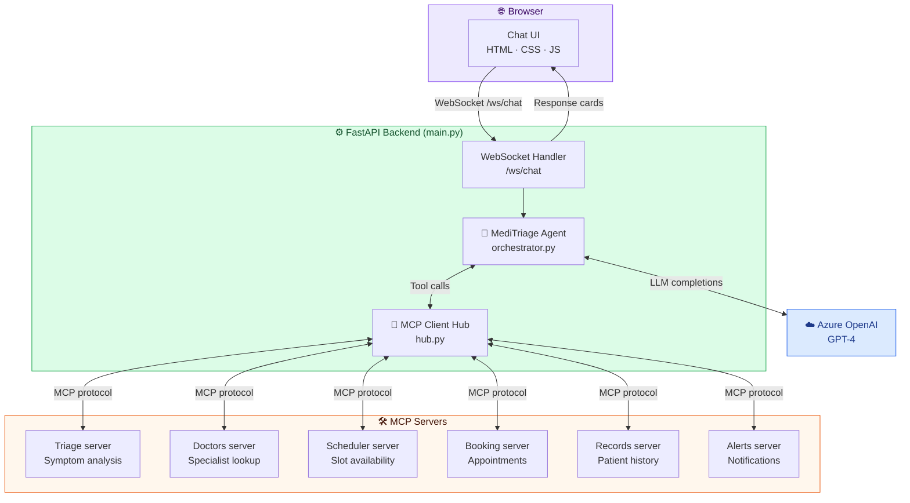
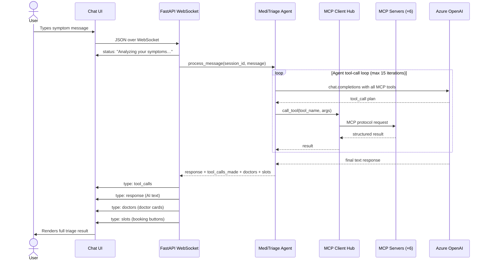
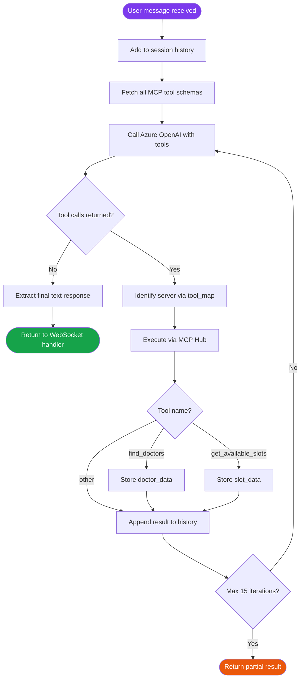

<div align="center">

# 🏥 MediTriage MCP

**An AI-powered medical triage assistant built on the Model Context Protocol.**

Describe your symptoms in plain language — MediTriage triages your case, finds the right specialist, and shows you available appointment slots, all in real time.

[](https://python.org)
[](https://fastapi.tiangolo.com)
[](https://azure.microsoft.com/en-us/products/ai-services/openai-service)
[](https://modelcontextprotocol.io)

</div>

---

## 📋 Table of contents

- [What is MediTriage?](#-what-is-meditriage)
- [Features](#-features)
- [Architecture](#-architecture)
- [Project structure](#-project-structure)
- [Tech stack](#-tech-stack)
- [Getting started](#-getting-started)
- [How it works](#-how-it-works)
- [API reference](#-api-reference)
- [Contributing](#-contributing)
- [Disclaimer](#-disclaimer)

---

## 🩺 What is MediTriage?

MediTriage is a real-time AI medical assistant that uses the **Model Context Protocol (MCP)** to connect an Azure OpenAI language model to a network of 6 specialized backend servers — each responsible for a distinct medical workflow: symptom triage, doctor discovery, appointment scheduling, and more.

Users interact through a chat interface. Behind the scenes, the AI agent dynamically selects and calls the right MCP tools, synthesizes the results, and returns a structured response complete with doctor cards and clickable booking slots.

---

## ✨ Features

| Feature | Description |
|---|---|
| 🤖 **AI Symptom Triage** | Describe symptoms in plain language — the agent classifies urgency and suggests the right specialty |
| 👨‍⚕️ **Doctor Discovery** | Finds relevant specialists based on your triage result |
| 📅 **Slot Booking** | Returns available appointment slots as interactive UI buttons |
| ⚡ **Real-time Chat** | Full-duplex WebSocket connection — zero page reloads |
| 🔌 **MCP Architecture** | 6 specialized MCP servers, each handling one domain |
| 🧠 **Persistent Sessions** | Per-session conversation history so the agent remembers context |
| 🖥️ **Built-in UI** | FastAPI serves the chat frontend — no separate server needed |

---

## 🏗️ Architecture

### System overview



---

### Request flow



---

### Agent loop detail



---

## 📁 Project structure

```
MediTriage-MCP/
│
├── backend/                        # FastAPI application
│   ├── agent/
│   │   ├── orchestrator.py         # MediTriageAgent — the AI brain
│   │   └── prompts.py              # System prompt for the LLM
│   ├── mcp_client/
│   │   └── hub.py                  # MCPClientHub — manages 6 server connections
│   ├── config.py                   # Azure OpenAI + server config (loads .env)
│   └── main.py                     # FastAPI app, WebSocket handler, static file serving
│
├── frontend/
│   └── index.html                  # Chat UI (served by FastAPI as static files)
│
├── mcp_servers/
│   └── triage/
│       ├── data/                   # Medical triage knowledge base
│       └── server.py               # MCP triage server implementation
│
├── scripts/                        # Utility and startup scripts
├── requirements.txt                # Python dependencies
└── .gitignore
```

---

## 🛠️ Tech stack

| Layer | Technology | Purpose |
|---|---|---|
| **Backend framework** | FastAPI + Uvicorn | HTTP server, WebSocket handler, static file serving |
| **Real-time comms** | WebSockets | Full-duplex chat between browser and server |
| **AI / LLM** | Azure OpenAI (GPT-4) | Language model for triage, synthesis, and reasoning |
| **Agent protocol** | MCP (Model Context Protocol) | Standardized interface to all tool servers |
| **Frontend** | HTML / CSS / JavaScript | Chat UI — served directly from FastAPI |
| **Configuration** | python-dotenv | Loads `.env` variables for API keys and endpoints |

---

## 🚀 Getting started

### Prerequisites

- Python **3.10+**
- An **Azure OpenAI** resource with a GPT-4 deployment
- Git

### 1. Clone the repo

```bash
git clone https://github.com/Ritheshcool/MediTriage-MCP.git
cd MediTriage-MCP
```

### 2. Install dependencies

```bash
pip install -r requirements.txt
```

### 3. Configure environment variables

Create a `.env` file in the project root:

```env
# Azure OpenAI
AZURE_OPENAI_ENDPOINT=https://your-resource.openai.azure.com/
AZURE_OPENAI_API_KEY=your_azure_openai_api_key
AZURE_OPENAI_DEPLOYMENT=your_deployment_name
AZURE_OPENAI_API_VERSION=2024-02-15-preview
```

### 4. Start the application

```bash
python -m backend.main
```

Or with Uvicorn directly:

```bash
uvicorn backend.main:app --host 0.0.0.0 --port 8000 --reload
```

### 5. Open the chat UI

Navigate to [http://localhost:8000](http://localhost:8000) — the frontend is served automatically.

At startup you'll see the 6 MCP servers connect in the logs:

```
✅ triage:     N tools — Symptom analysis
✅ doctors:    N tools — Specialist lookup
✅ scheduler:  N tools — Slot availability
✅ booking:    N tools — Appointment booking
✅ records:    N tools — Patient history
✅ alerts:     N tools — Notifications

MediTriage ready — X tools across 6 servers
```

---

## 🔍 How it works

### The MCP Client Hub

`hub.py` connects to all 6 MCP servers on startup and aggregates their tool schemas. When the agent needs a tool, the hub routes the call to the correct server using an internal `tool_map`.

### The AI Agent

`orchestrator.py` runs a **tool-calling loop** (up to 15 iterations per message):

1. Sends conversation history + all MCP tool schemas to Azure OpenAI
2. If the LLM returns tool calls, executes them via the hub and appends results to history
3. Loops until the LLM returns a plain-text response (no further tool calls)
4. Extracts `doctor_data` and `slot_data` from specific tool results for the frontend

### The WebSocket handler

`main.py` sends multiple typed messages back to the UI for each user message:

```
type: "status"      → "Analyzing your symptoms…"
type: "tool_calls"  → which servers were invoked
type: "response"    → the AI's triage text
type: "doctors"     → doctor cards (if applicable)
type: "slots"       → booking buttons (if applicable)
```

---

## 📡 API reference

### `GET /`

Serves the chat frontend (`index.html`).

### `GET /api/status`

Returns connection status and available tools for all 6 MCP servers.

```json
{
  "triage":    { "connected": true, "tools": ["..."], "description": "Symptom analysis" },
  "doctors":   { "connected": true, "tools": ["..."], "description": "Specialist lookup" },
  "scheduler": { "connected": true, "tools": ["..."], "description": "Slot availability" }
}
```

### `WS /ws/chat`

WebSocket endpoint for the real-time chat.

**Send** (client → server):

```json
{ "message": "I have a fever and sore throat for 3 days" }
```

**Receive** (server → client) — multiple messages per request:

| `type` | Payload | Description |
|---|---|---|
| `status` | `{ "message": "..." }` | Thinking indicator |
| `tool_calls` | `{ "calls": [{"server": "...", "tool": "..."}] }` | Which MCP tools were used |
| `response` | `{ "message": "...", "tool_calls_count": N }` | The AI's triage response |
| `doctors` | `{ "specialty": "...", "doctors": [...] }` | Doctor recommendation cards |
| `slots` | `{ "doctor": "...", "slots": [...] }` | Available booking slots |
| `error` | `{ "message": "..." }` | Error details |

---

## 🤝 Contributing

Contributions are welcome! Here's how:

1. **Fork** the repository
2. **Create** a feature branch: `git checkout -b feature/your-feature`
3. **Commit** your changes: `git commit -m "feat: add your feature"`
4. **Push** to the branch: `git push origin feature/your-feature`
5. **Open** a Pull Request

Please keep PRs focused — one feature or fix per PR makes review much easier.

---

## ⚠️ Disclaimer

> MediTriage is a **demonstration project** and is **not a substitute for professional medical advice, diagnosis, or treatment**. Always consult a qualified healthcare provider for any medical concerns. In a medical emergency, call your local emergency services immediately.

---

<div align="center">

Built with ❤️ using FastAPI · Azure OpenAI · Model Context Protocol

</div>
